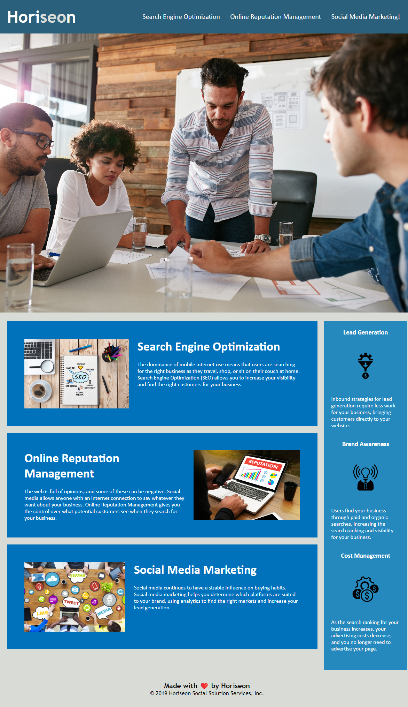

# over-the-horiseon webpage

## Descripton
This webpage was refactored in order to make it more accessible as well as optimized for search engine use. 

In order to do so, the code was divided into different semantic elements rather than just having general divs. All images were given an alt attribute - very important for those using screen readers or smaller mobile phone screens, as well as users who are visually impaired. These alt attributes would also come in handy, developer and end-user alike, if the images are broken or fail to load. 

The title of the webpage was ammended to include SEO and Social Media Marketing Experts to direct users to this website when using those words in a search engine.

DRY code was removed to streamline the CSS and improve workflow efficiency. Although much of the dry code was removed, i faced an issue with other parts which i am yet to get to the bottom of. 

## Installation
N/A

## Usage

The website should look like the above screenshot image
Accessible at: https://emkhan89.github.io/over-the-horiseon/#search-engine-optimization 

## Credits
N/A

## License
Please refer to the license in the repo.